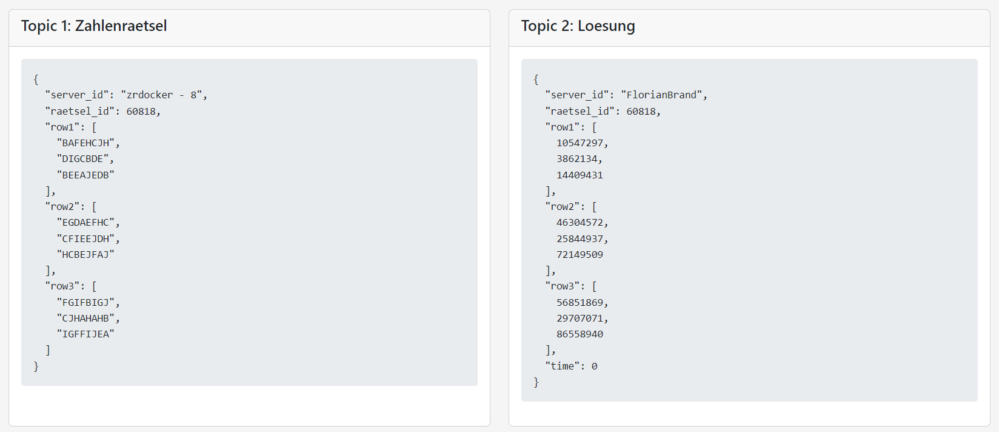

# MQTT Web Display


Note: Only the most recent message of each topic is shown.

## Usage

Build the project using `./gradlew bootJar`

Build the Docker image: `docker build -t mqtt-web-display .`

Run the Docker container:
```
docker run -d -p 8080:8080 --name mqtt-web-display \
  -e mqtt.url="YOUR_MQTT_URL" \
  -e mqtt.username="YOUR_MQTT_USERNAME" \
  -e mqtt.password="YOUR_MQTT_PASSWORD" \
  -e mqtt.topic1="YOUR_TOPIC1_NAME" \
  -e mqtt.topic2="YOUR_TOPIC2_NAME" \
  mqtt-web-display
```

Important: `YOUR_MQTT_URL` should include full URL including the port!